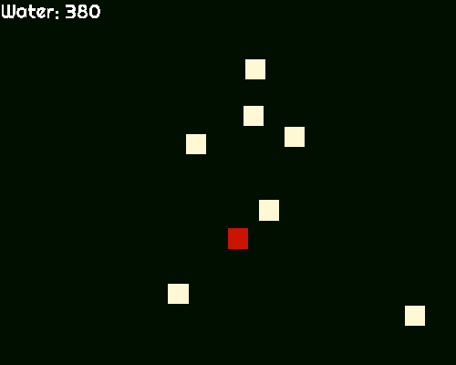

### A very short firefighter game with squares and circles, made with pygame.
---

This is one of my first projects on pygame which is actually a game.
You're a square firefighter and fires appear randomly on the screen. You need to put them out. Fast.

### **How to install and run:**

**The game requires python 3.7**

* Install python 3.7 => https://www.python.org/
* Install pipenv => https://pipenv.kennethreitz.org/en/latest/install/#installing-pipenv
* Install dependencies (pygame): `pipenv install`
* Activate virtual environment: `pipenv shell`
* Run: `./firefighter` 

### * How to play:

* Use WASD keys to move and the arrow keys to use your hose on the fires
* Put out as many fires as you can. The game is over when:
  - You run out of water
  - There's more than 10 fire sources.
